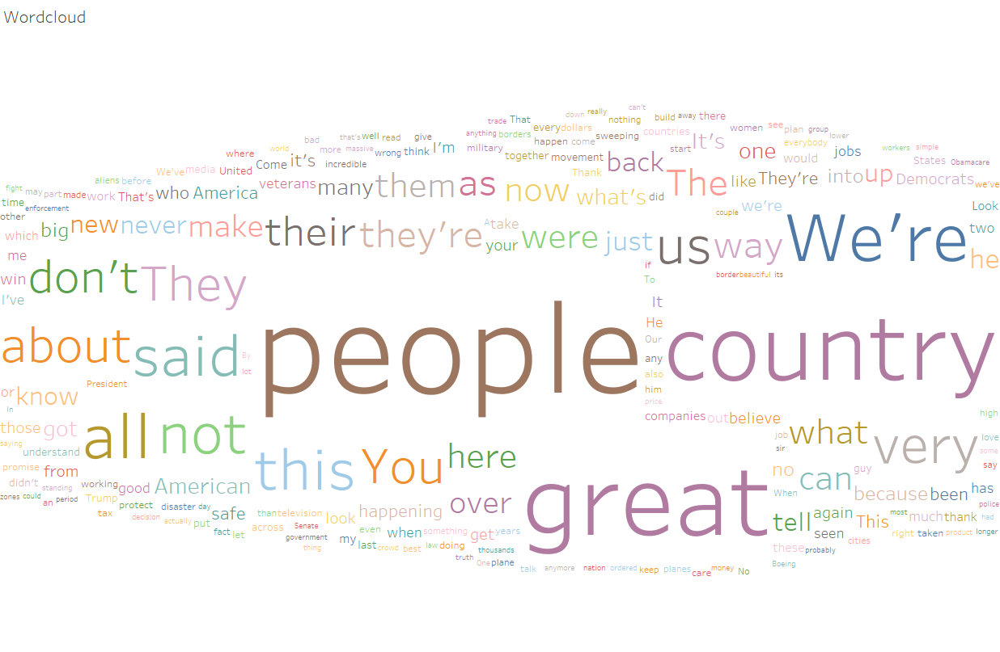

# Wordclouds

<<<<<<< HEAD
Les wordclouds -ou tagclouds- sont une représentation visuelle d'une "weighted list". Il s'agit en général d'un affichage de mots simples, dont l'importance (souvent la récurrence) est représentée par la taille et la couleur du mot. 
=======
Wordcloud of a Donald Trump speech during his campaign, using tableau.
>>>>>>> 3f7308d10858bde45bad0e7705af72fddf96ba3b

Il est possible de faire un wordcloud avec
 * un texte, pour faire ressortir les mots les plus répétés
 * des tags d'articles ou de mails
 * des noms de pays par exemple, où la taille du mot reprénsente la population du pays, etc...

## Wordcloud à partir d'un texte

Ce premier exemple est un wordcloud réalisé sur tableau ([lien vers le tableau output](http://www.palmbeachpost.com/news/national/read-full-transcript-trump-rally-speech-florida/DeDCpoNEKLQmWcIKndWB0M/)) à partir d'un discours de campagne de Donald Trump. ([lien vers le transcript utilisé](http://www.palmbeachpost.com/news/national/read-full-transcript-trump-rally-speech-florida/DeDCpoNEKLQmWcIKndWB0M/))

Tableau output : https://public.tableau.com/profile/roland7442#!/vizhome/TrumpCampainSpeechWordcloud/Feuille1?publish=yes

