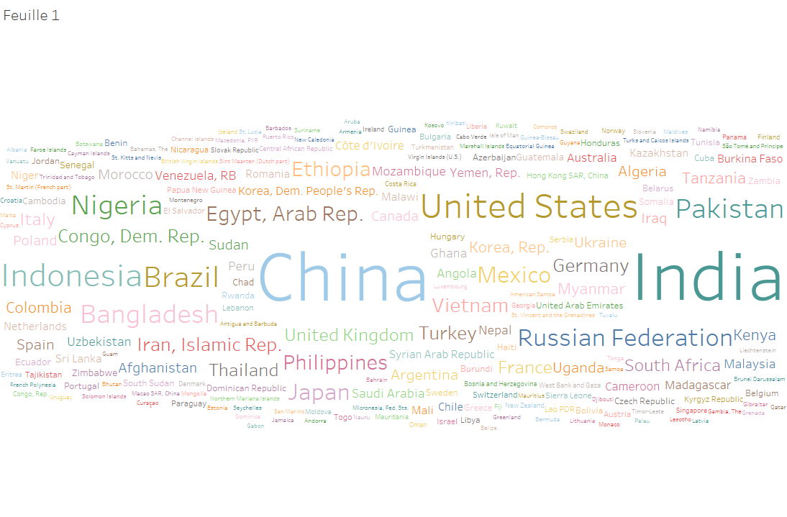
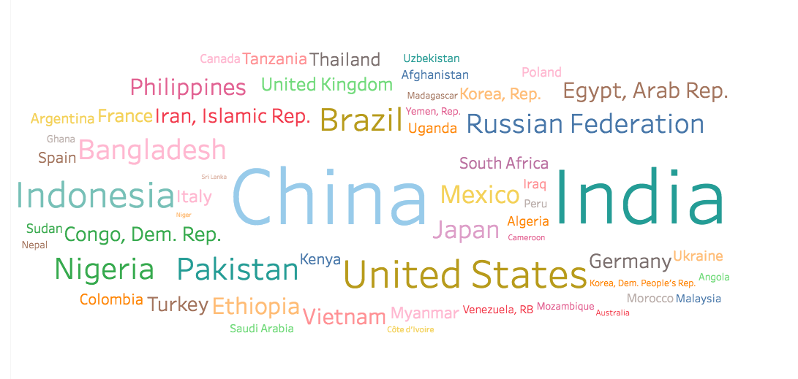
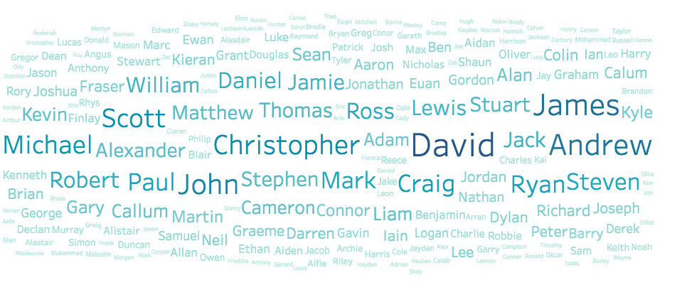

# Wordclouds

Les wordclouds -ou tagclouds- sont une représentation visuelle d'une "weighted list". Il s'agit en général d'un affichage de mots simples, dont l'importance (souvent la récurrence) est représentée par la taille et la couleur du mot. 

Il est possible de faire un wordcloud avec
 * un texte, pour faire ressortir les mots les plus répétés
 * des tags d'articles ou de mails
 * des noms de pays par exemple, où la taille du mot reprénsente la population du pays, etc...

### Histoire

Un des permiers wordcloud en anglais serait apparu dans les "subconscious files" dans Microserfs (1995) de Douglas Coupland.

La popularité des wordclouds est montée avec l'arrivée du web 2.0, dans les blogs et autres site webs. Flickr, le site de partage de photos, Del.icio.us ou Technorati fesaient partie des sites les plus connus l'ayant utilisé comme outil de navigation.

Après un certain temps, la sur-saturation de leur utilisation et l'ambiguité de leur utilité a entrainé un déclin dans leur utilisation. Apparemment, Flicker se serait excusé en 2006 auprès de la communauté de développeur pour avoir mis les tagclouds dans leur "best practices". ([Source : Wikipedia](https://en.wikipedia.org/wiki/Tag_cloud))

Ce à quoi ressemblait un tag cloud chez Flickr :

Une nouvelle génération de logiciels utilisent les wordclouds comme méthode pour visualizer des données textuelles. Par exemple, les Parallel Tag Clouds([Youtube](https://www.youtube.com/watch?v=rL3Ga6xBgLw)), les SparkClouds([Article en pdf](https://web.archive.org/web/20130928054952/http://research.microsoft.com/en-us/um/people/nath/docs/sparkclouds_infovis2010.pdf)) ou les Prefix Tag Clouds.([Article en pdf](http://www.vis.uni-stuttgart.de/uploads/tx_vispublications/PrefixTagClouds-IV2013.pdf)).

## Wordcloud à partir d'un texte

Ce premier exemple est un wordcloud réalisé sur tableau ([lien vers le tableau output](https://public.tableau.com/profile/roland7442#!/vizhome/TrumpCampainSpeechWordcloud/Feuille1?publish=yes)) à partir d'un discours de campagne de Donald Trump. ([lien vers le transcript utilisé](http://www.palmbeachpost.com/news/national/read-full-transcript-trump-rally-speech-florida/DeDCpoNEKLQmWcIKndWB0M/))

## Wordcloud des pays par population

Ce wordcloud représente la population de chaque pays du monde.

[Source des données](https://data.worldbank.org/data-catalog/Population-ranking-table)

[Lien vers le tableau](https://public.tableau.com/profile/roland7442#!/vizhome/CountriesWordcloud/Feuille1?publish=yes)

Le nombre important de pays représentés diminue la lisibilité du graphique. Voici les mêmes données, mais en filtrant les pays ayant une population inférieure à 20000 habitants

## Wordcloud 

Ceci est un wordcloud sur les 100 prénoms de garçons les plus populaires (taille = nombre d'occurence)

[Source des données](https://www.nrscotland.gov.uk/statistics-and-data/statistics/statistics-by-theme/vital-events/names/babies-first-names/babies-first-names-summary-records-comma-separated-value-csv-format)

[Lien vers le tableau](https://public.tableau.com/profile/roland7442#!/vizhome/MostpopularBoysNames/Feuille1)

A titre de comparaison, voici les mêmes données, mais affichés en diagramme à barre.

Dans le diagramme en barre, les mêmes données prennent bien plus de place à l'affichage et sont plus difficile à lire. On gagne cependant en précision.

## Conclusion

Les mots plus long sont plus mis en avant que les autres (United States et Christopher, par exemple)

Les mots du milieu attirent forcément plus l'attention et sont donc plus mis en avant que ceux sur les bords.

La couleur peut être utilisée pour accentuer l'effet de la taille.

Réduire le nombre de mots dans un wordcloud le rends souvent plus lisible. On peut par exemple filter les mots les moins important.